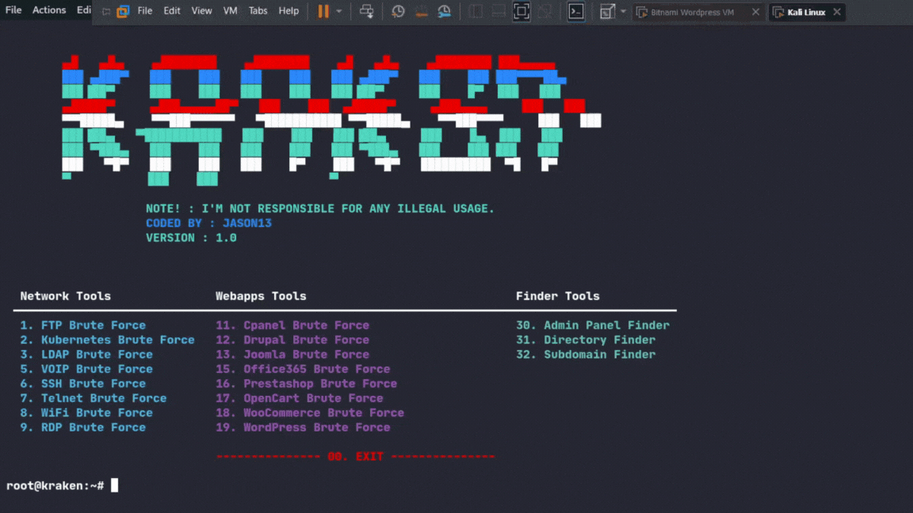

<h1 align="center">
  <a href="">
    <picture>
      <source height="125" media="(prefers-color-scheme: dark)" srcset="https://i.imgur.com/iuvsqmp.png">
      
    </picture>
  </a>
  <br>
</h1>
<p align="center">
   A Python-based tool to centralize and streamline BruteForce Attacks
</p>



---

## About The Project
<b>Kraken</b> is a powerful, Python-based tool designed to centralize and streamline various brute-forcing tasks. Kraken provides a suite of tools for cybersecurity professionals to efficiently perform brute-force attacks across a range of protocols and services.

## ⚠️  WARNING: LEGAL DISCLAIMER

This tool is intended for educational purposes only. The author is not responsible for any illegal use of this tool. Users aresolely responsible 
for their actions.

---

## 👀 Screenshots

<p float="left" align="middle">
  
  
</p>
<p float="left" align="middle">
  
  
</p>
<p float="left" align="middle">
  
  
</p>

---

## ⚙️ Installation

To install Kraken, follow these steps:

```bash
git clone https://github.com/jasonxtn/kraken.git
cd Kraken
pip install -r requirements.txt
```

To launch Kraken:

```bash
python kraken.py
```

---

## 📖 Usage

Kraken offers a variety of tools for brute-forcing:

1. **Network Tools:**
   - FTP Brute Force
   - Kubernetes Brute Force
   - LDAP Brute Force
   - VOIP Brute Force
   - SSH Brute Force
   - Telnet Brute Force
   - WiFi Brute Force
   - WPA3 Brute Force

2. **Webapps Tools:**
   - CPanel Brute Force
   - Drupal Brute Force
   - Joomla Brute Force
   - Magento Brute Force
   - Office365 Brute Force
   - Prestashop Brute Force
   - OpenCart Brute Force
   - WooCommerce Brute Force
   - WordPress Brute Force
3. **Finder Tools:**
   - Admin Panel Finder
   - Directory Finder
   - Subdomain Finder

### To use a specific tool:

1. Launch Kraken from the command line.
2. Select the desired tool from the main menu by typing its corresponding number.
3. Follow the on-screen prompts to input the required information.
4. Review the results provided by the tool.

### Example:

```bash
root@kraken:~# 1
```
This command would start the FTP Brute Force tool.

---

## ⭐️ Show Your Support

If you find Kraken helpful or interesting, please consider giving us a star on GitHub. Your support helps promote the project and lets others know that it's worth checking out.

Thank you for your support! 🌟
